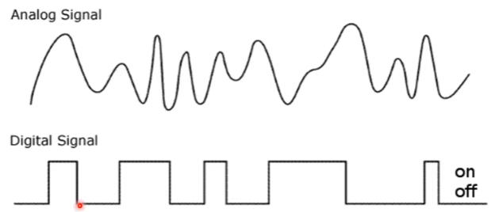
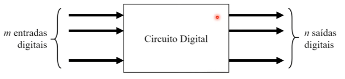
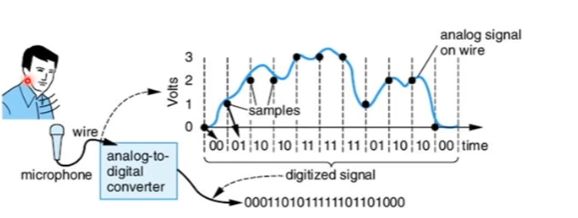
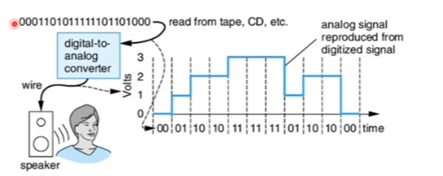
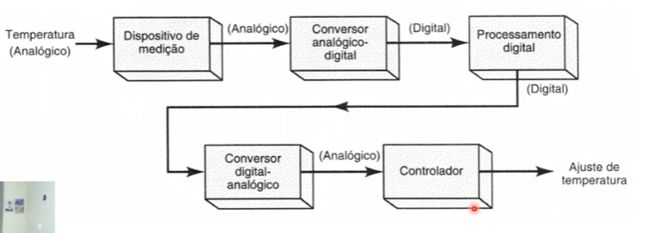

# O que é um circuito digital?

## Sinais Analógicos vs. Sinais Digitais

### Sinal analógico
Assume **infinitos valores** de amplitude.

### Sinal digital
Assume apenas **valores finitos** de amplitude.

**Observação:**  
O sinal digital está apenas **ligado ou desligado**.  
O sinal analógico, em compensação, pode assumir **infinitos valores**.

### Exemplos
- Uma lâmpada está ligada ou desligada → **digital**
- Os dedos da mão são um número finito → **digital**
- A voz humana é um sinal analógico, pois possui infinitos tons e variações

---

## Circuitos Digitais

A diferença entre circuitos analógicos e digitais está relacionada às formas de onda que processam:

- **Circuitos analógicos:** processam e geram ondas analógicas  
- **Circuitos digitais:** processam e geram ondas digitais

Um **circuito digital** é aquele que recebe sinais digitais como entrada, processa e retorna saídas digitais.

Exemplo: uma caixa com **m entradas digitais** e **n saídas digitais** (não precisam ser iguais).

---

## Onde encontramos circuitos digitais?

- Computadores  
- Chips internos de celulares  
- Câmeras digitais  
- Video-games  
- Dispositivos médicos  

---

## Sinais binários

Os sinais digitais mais comuns assumem apenas dois valores de amplitude:

- **1** (Ligado ou ALTO)  
- **0** (Desligado ou BAIXO)  

Esse tipo de sinal é denominado **sinal binário**.

Esses sinais são representados como níveis de tensão:

- Nível ALTO → +5V  
- Nível BAIXO → 0V  

---

## Vantagens dos circuitos digitais

- Mais fáceis de projetar  
- Armazenamento de informação mais simples que em circuitos analógicos  
- Sistemas mais precisos  
- Maior versatilidade  
- Mais robustos ao ruído  
- Podem ser mais baratos que sistemas totalmente analógicos  
- Permitem técnicas modernas de processamento digital (criptografia, codificação, etc.)

---

## Por que estudar circuitos digitais?

- Entender o funcionamento dos computadores  
- Projetar circuitos eletrônicos  

---

## Conversão Analógico-Digital (A/D)

Na natureza, a maioria dos sinais é **analógica**, mas circuitos digitais só processam sinais digitais.

### Problema
Como aproveitar as vantagens dos circuitos digitais para processar sinais analógicos?

### Exemplo
Temperatura de uma sala → é um sinal analógico.

**Solução:**  
Converter o sinal analógico para digital → **Conversão Analógico-Digital (A/D)**.

---

## Etapas da Conversão A/D

O processo de conversão A/D consiste em:

1. **Amostragem** – coletar valores do sinal analógico  
2. **Quantização** – aproximar esses valores para níveis discretos  
3. **Codificação** – transformar os valores em binário  

### Exemplo prático
Um usuário grava voz com um microfone:  
A voz é analógica e precisa ser convertida para digital para ser processada por um circuito digital.

---

## Conversão Digital-Analógica (D/A)

Circuitos digitais produzem apenas saídas digitais, mas muitos sistemas precisam de saídas analógicas.

A **conversão Digital-Analógica (D/A)** transforma um sinal digital em um sinal analógico equivalente.

---

## A/D e D/A em conjunto

Em muitos sistemas, os processos A/D e D/A trabalham juntos.

### Exemplo
Sistema de controle de temperatura de um ar-condicionado.

