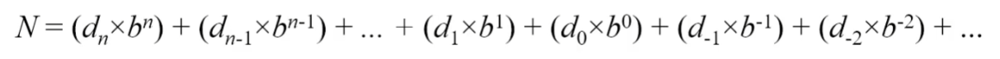
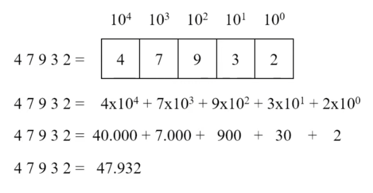
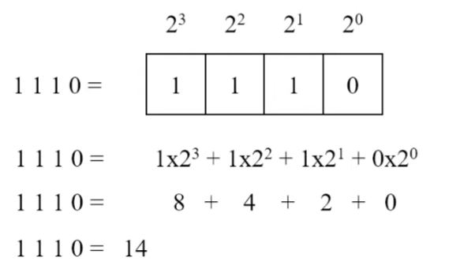
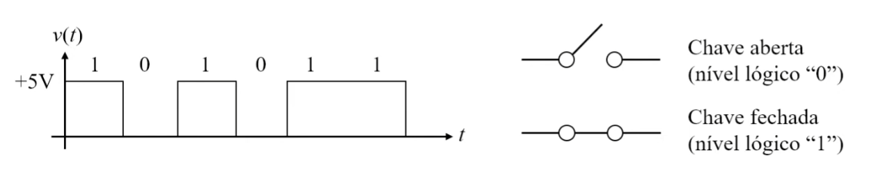
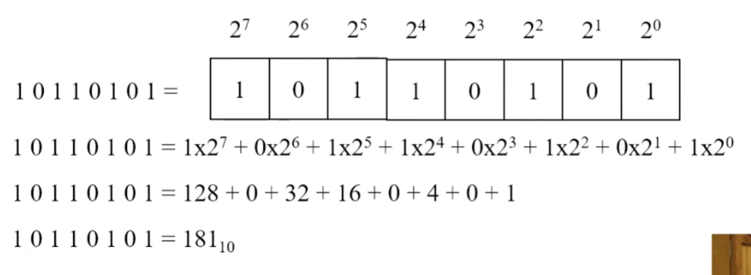
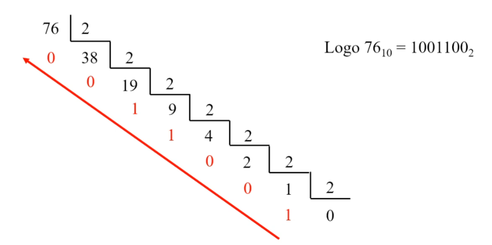
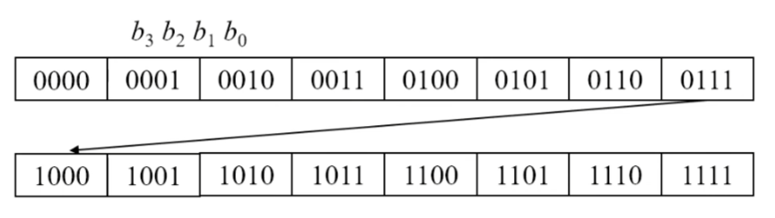

# Sistemas de Numeração

## O que é um número?

**Número** é uma forma de representação de quantidades.

Na antiguidade, pastores utilizavam **pedrinhas** para representar a quantidade de ovelhas que possuíam.  
Isso já era uma forma de **representação numérica**.

Atualmente, utilizamos formas mais avançadas e **abstratas** de representar números, principalmente de forma **gráfica e simbólica**.

---

## Sistema de Numeração

Um **sistema de numeração** é a representação de um número a partir de um **conjunto de símbolos (dígitos)**.

### Conceito de base

Um parâmetro fundamental em qualquer sistema de numeração é a **base**.

A base indica:

- A quantidade de **dígitos** do sistema  
- A **base exponencial** usada no peso de cada dígito na composição do número  

---

## Sistemas de Numeração mais comuns

- **Sistema decimal**
- **Sistema binário**
- **Sistema hexadecimal**

---

## Regra Geral de Formação de um Número

Seja um número representado como:

dₙ, dₙ₋₁, …, d₁, d₀, d₋₁, d₋₂, …

em uma base **b**.

O seu equivalente decimal é obtido pela soma de cada dígito multiplicado pela base elevada à sua posição.

---

## Sistema Decimal de Numeração

O **sistema decimal** é um sistema **posicional de base 10**, utilizado no dia a dia.

### Características

- Possui **10 dígitos possíveis**:  
  0, 1, 2, 3, 4, 5, 6, 7, 8 e 9  
- Cada dígito possui um **peso**, dado por potências de 10  
- O expoente depende da **posição relativa** do dígito no número  

---

### Exemplo: número 47932

Quando a vírgula **não está explicitamente indicada**, considera-se que ela está **após o último dígito**.

Nesse caso:
- O dígito **2** está na posição **10⁰**

Aplicando a regra geral de formação:

---

## Contagem no Sistema Decimal

0, 1, 2, 3, 4, 5, 6, 7, 8, 9

Ao chegar no **9**:
- Zera-se a unidade  
- Soma-se **1** à dezena  

10, 11, 12, …, 19

Depois:
- Zera-se unidade e dezena  
- Soma-se **1** à centena  

### Conclusões

- Unidades variam a cada **1** → 10⁰  
- Dezenas variam a cada **10** → 10¹  
- Centenas variam a cada **100** → 10²  
- Com **N dígitos**, pode-se escrever:
  - **10ⁿ números**
  - Número máximo: **10ⁿ − 1**

---

## Sistema Binário de Numeração

O **sistema binário** é o mais utilizado na **eletrônica digital**.

### Características

- Sistema posicional de **base 2**
- Dígitos possíveis: **0** e **1**
- Cada dígito é ponderado por potências de 2

---

### Exemplo: número 1110₂

Para evitar confusão:
- **1110₂ = 14₁₀**

---

## Bits e Valor Posicional

- Cada dígito binário é chamado de **bit**
- **8 bits = 1 byte**

- **MSB**: bit mais significativo (maior peso)  
- **LSB**: bit menos significativo (menor peso)  

---

## Por que usamos o sistema binário?

Circuitos digitais operam com **níveis de tensão**.

- Sistema decimal → exigiria **10 níveis de tensão**
- Sistema binário → apenas **2 níveis**

- Chave aberta → **0**
- Chave fechada → **1**

Esses níveis (0V e 5V) caracterizam a tecnologia **TTL**.

---

## Conversão Binário → Decimal

### Exemplo 1

Converter **11011₂** para decimal.

---

## Conversão Decimal → Binário

### Métodos

- Soma ponderada  
- Divisões sucessivas por 2  

---

### Método 1: Soma Ponderada

Tabela de potências de 2:

| Potência | Valor |
|--------:|------:|
| 2⁰ | 1 |
| 2¹ | 2 |
| 2² | 4 |
| 2³ | 8 |
| 2⁴ | 16 |
| 2⁵ | 32 |
| 2⁶ | 64 |
| 2⁷ | 128 |

Exemplo: **76₁₀**

| Potência | Valor | Entra? | Bit |
|--------:|------:|:------:|:---:|
| 2⁶ | 64 | sim | 1 |
| 2⁵ | 32 | não | 0 |
| 2⁴ | 16 | não | 0 |
| 2³ | 8 | sim | 1 |
| 2² | 4 | sim | 1 |
| 2¹ | 2 | não | 0 |
| 2⁰ | 1 | não | 0 |

Resultado: **1001100₂**

---

### Método 2: Divisões Sucessivas por 2

1. Divide-se por 2  
2. Guarda-se quociente e resto  
3. Repete-se até Q = 0  
4. Os restos formam o número binário:
   - Primeiro resto → **LSB**
   - Último resto → **MSB**

---

## Contagem no Sistema Binário

Exemplo: **4 bits**

### Conclusões

- b₀ varia a cada **1** → 2⁰  
- b₁ varia a cada **2** → 2¹  
- b₂ varia a cada **4** → 2²  
- b₃ varia a cada **8** → 2³  

Com **N bits**:
- Total: **2ⁿ números**
- Máximo: **2ⁿ − 1**

---

## Tabela de Equivalência (4 bits)

| Decimal | 2³ | 2² | 2¹ | 2⁰ |
|--------:|:--:|:--:|:--:|:--:|
| 0 | 0 | 0 | 0 | 0 |
| 1 | 0 | 0 | 0 | 1 |
| 2 | 0 | 0 | 1 | 0 |
| 3 | 0 | 0 | 1 | 1 |
| 4 | 0 | 1 | 0 | 0 |
| 5 | 0 | 1 | 0 | 1 |
| 6 | 0 | 1 | 1 | 0 |
| 7 | 0 | 1 | 1 | 1 |
| 8 | 1 | 0 | 0 | 0 |
| 9 | 1 | 0 | 0 | 1 |
| 10 | 1 | 0 | 1 | 0 |
| 11 | 1 | 0 | 1 | 1 |
| 12 | 1 | 1 | 0 | 0 |
| 13 | 1 | 1 | 0 | 1 |
| 14 | 1 | 1 | 1 | 0 |
| 15 | 1 | 1 | 1 | 1 |

### Observação

- 2³ repete o valor a cada **8 linhas**
- 2² a cada **4**
- 2¹ a cada **2**
- 2⁰ a cada **1**

Isso reflete o **peso posicional dos bits**.
