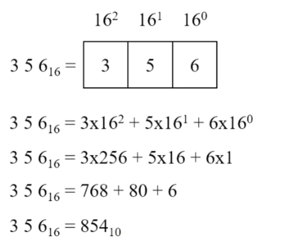
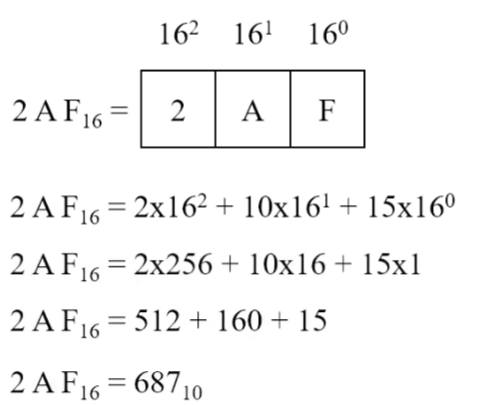
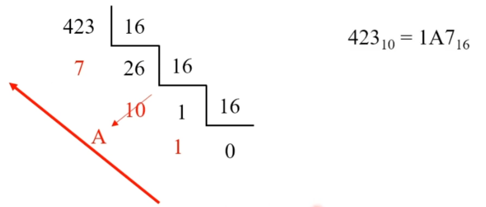

# Sistema Hexadecimal de Numeração

O **sistema hexadecimal** é um sistema **posicional de base 16**.

---

## Características do sistema hexadecimal

- Sistema posicional de **base 16**
- Possui **16 dígitos possíveis**:  
  0, 1, 2, 3, 4, 5, 6, 7, 8, 9, **A, B, C, D, E, F**
- Cada dígito é ponderado por um **peso na base 16**, com expoente definido pela posição

---

## Relação entre os sistemas decimal, binário e hexadecimal

| Decimal | Binário | Hexadecimal |
|--------:|:-------:|:-----------:|
| 0  | 0000 | 0 |
| 1  | 0001 | 1 |
| 2  | 0010 | 2 |
| 3  | 0011 | 3 |
| 4  | 0100 | 4 |
| 5  | 0101 | 5 |
| 6  | 0110 | 6 |
| 7  | 0111 | 7 |
| 8  | 1000 | 8 |
| 9  | 1001 | 9 |
| 10 | 1010 | A |
| 11 | 1011 | B |
| 12 | 1100 | C |
| 13 | 1101 | D |
| 14 | 1110 | E |
| 15 | 1111 | F |

**Observação:**  
Cada **dígito hexadecimal é representado exatamente por 4 bits** no sistema binário.

---

## Contagem no sistema hexadecimal

Considere os dígitos posicionais:

- h₂, h₁, h₀

Sequência inicial:

0 1 2 3 4 5 6 7 8 9 A B C D E F

Quando o dígito **h₀** atinge **F** (valor máximo):

- Zera-se **h₀**
- Soma-se **1** ao dígito **h₁**

Resultando em:

10, 11, 12, 13, 14, 15, 16, 17, 18, 19, 1A, 1B, 1C, 1D, 1E, 1F

O processo continua:

20, 21, 22, 23, 24, 25, 26, 27, 28, 29, 2A, 2B, 2C, 2D, 2E, 2F

---

### Avanço da contagem

Após 9F:

- h₀ atinge o máximo
- Soma-se **1** em h₁
- Zera-se h₀

Após o 9, surgem os dígitos alfabéticos:

A0, A1, A2, A3, A4, A5, A6, A7, A8, A9, AA, AB, AC, AD, AE, AF

Depois:

F0, F1, F2, F3, F4, F5, F6, F7, F8, F9, FA, FB, FC, FD, FE, FF

Quando chega em **FF**:

- h₀ e h₁ atingem o valor máximo
- Soma-se **1** em **h₂**
- Zera-se h₁ e h₀

Resultando em:

100, 101, 102, 103, 104, 105, 106, 107, 108, 109, 10A, 10B, 10C, 10D, 10E, 10F

---

## Tabela de contagem hexadecimal

| 0  | 1  | 2  | 3  | 4  | 5  | 6  | 7  | 8  | 9  | A  | B  | C  | D  | E  | F  |
|----|----|----|----|----|----|----|----|----|----|----|----|----|----|----|----|
| 00 | 01 | 02 | 03 | 04 | 05 | 06 | 07 | 08 | 09 | 0A | 0B | 0C | 0D | 0E | 0F |
| 10 | 11 | 12 | 13 | 14 | 15 | 16 | 17 | 18 | 19 | 1A | 1B | 1C | 1D | 1E | 1F |
| 20 | 21 | 22 | 23 | 24 | 25 | 26 | 27 | 28 | 29 | 2A | 2B | 2C | 2D | 2E | 2F |
| 30 | 31 | 32 | 33 | 34 | 35 | 36 | 37 | 38 | 39 | 3A | 3B | 3C | 3D | 3E | 3F |
| 40 | 41 | 42 | 43 | 44 | 45 | 46 | 47 | 48 | 49 | 4A | 4B | 4C | 4D | 4E | 4F |
| 50 | 51 | 52 | 53 | 54 | 55 | 56 | 57 | 58 | 59 | 5A | 5B | 5C | 5D | 5E | 5F |
| 60 | 61 | 62 | 63 | 64 | 65 | 66 | 67 | 68 | 69 | 6A | 6B | 6C | 6D | 6E | 6F |
| 70 | 71 | 72 | 73 | 74 | 75 | 76 | 77 | 78 | 79 | 7A | 7B | 7C | 7D | 7E | 7F |
| 80 | 81 | 82 | 83 | 84 | 85 | 86 | 87 | 88 | 89 | 8A | 8B | 8C | 8D | 8E | 8F |
| 90 | 91 | 92 | 93 | 94 | 95 | 96 | 97 | 98 | 99 | 9A | 9B | 9C | 9D | 9E | 9F |
| A0 | A1 | A2 | A3 | A4 | A5 | A6 | A7 | A8 | A9 | AA | AB | AC | AD | AE | AF |
| B0 | B1 | B2 | B3 | B4 | B5 | B6 | B7 | B8 | B9 | BA | BB | BC | BD | BE | BF |
| C0 | C1 | C2 | C3 | C4 | C5 | C6 | C7 | C8 | C9 | CA | CB | CC | CD | CE | CF |
| D0 | D1 | D2 | D3 | D4 | D5 | D6 | D7 | D8 | D9 | DA | DB | DC | DD | DE | DF |
| E0 | E1 | E2 | E3 | E4 | E5 | E6 | E7 | E8 | E9 | EA | EB | EC | ED | EE | EF |
| F0 | F1 | F2 | F3 | F4 | F5 | F6 | F7 | F8 | F9 | FA | FB | FC | FD | FE | FF |
|100 |101 |102 |103 |104 |105 |106 |107 |108 |109 |10A |10B |10C |10D |10E |10F |

---

## Variação dos dígitos hexadecimais

- h₀ varia a cada **1** contagem → 16⁰  
- h₁ varia a cada **16** contagens → 16¹  
- h₂ varia a cada **256** contagens → 16²  

Com **N dígitos hexadecimais**:
- Total de números: **16ⁿ**
- Maior número: **16ⁿ − 1**

---

## Exemplo 4

(i) Quantos números podem ser representados com **3 dígitos hexadecimais**?

- Quantidade = 16³ = **4.096**

(ii) Qual o maior número com **3 dígitos hexadecimais**?

- Máximo = 16³ − 1 = **4.095**

---

## Conversão Hexadecimal → Decimal

### Exemplo 5

(i) Converter **356₁₆** para decimal:

(ii) Converter **2AF₁₆** para decimal:

---

## Conversão Hexadecimal → Binário

A conversão é feita substituindo **cada dígito hexadecimal** pelo seu **equivalente binário de 4 bits**.

### Exemplo 6

(i) Converter **CF8E₁₆**:

| Hex     | C    | F    | 8    | E    |
|---------|------|------|------|------|
| Binário | 1100 | 1111 | 1000 | 1110 |

Resultado:

CF8E₁₆ = **1100111110001110₂**

(ii) Converter **9742₁₆**:

| Hex     | 9    | 7    | 4    | 2    |
|---------|------|------|------|------|
| Binário | 1001 | 0111 | 0100 | 0010 |

Resultado:

9742₁₆ = **1001011101000010₂**

**Observação:**  
O hexadecimal é amplamente utilizado por permitir uma **representação compacta** de longas sequências de bits, reduzindo erros de digitação.

---

## Conversão Binário → Hexadecimal

Procedimento:

1. Agrupar o número binário em **grupos de 4 bits**, da direita para a esquerda
2. Converter cada grupo para o símbolo hexadecimal equivalente

### Exemplo 7

(i) **1100101001010111₂**

1100 1010 0101 0111 → **CA57₁₆**

(ii) **111111000101101001₂**

00 1111 1100 0101 1010 01 → **3F169₁₆**

---

## Conversão Decimal → Hexadecimal

Método utilizado:
- **Divisões sucessivas por 16**
- Alternativamente:
  - Decimal → Binário → Hexadecimal

### Exemplo 8

Converter **423₁₀**:

